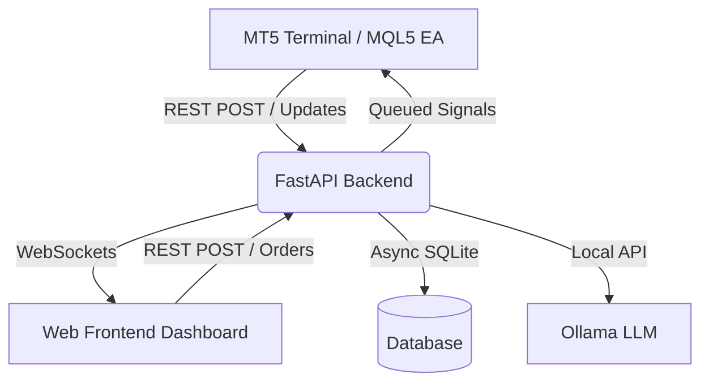

# 🚀 AI Quant Terminal v5

[](https://opensource.org/licenses/MIT)
[](https://fastapi.tiangolo.com/)
[](https://ollama.ai/)
[](https://www.mql5.com/)

An advanced, real-time AI-powered trading platform that bridges **MetaTrader 5 (MT5)**, a **FastAPI backend**, and a **Local LLM (Ollama)** to deliver institutional-grade market intelligence, visual analytics, and autonomous trade execution.

---

## 🌟 Key Features

### 🧠 1. Local AI Intelligence
- **Ollama Integration**: Uses local models (like `llama3:8b`) to prevent data leakage and ensure zero latency in signal processing.
- **AI Decision Engine**: Multi-agent debate simulation and RAG (Retrieval-Augmented Generation) context handling for robust signal validation.
- **Pattern Recognition**: Automated detection of chart patterns analyzed by AI.

### 📊 2. Institutional-Grade UI
- **Real-Time Charting**: High-performance canvas charting with live candle updates via WebSockets.
- **Volume Profile & TPO**: Visualize volume nodes, POC (Point of Control), VAH, and VAL.
- **Multi-Timeframe Analysis**: Instant trend bias and indicator alignment from M1 to Weekly.
- **Advanced Indicators Panel**: Parity with MT5 including Bollinger Bands, EMAs, Williams %R, SAR, and more.

### 🔗 3. Seamless MT5 Integration
- **Direct MQL5 Bridge**: No middleman DLLs. Native `WebRequest` communication.
- **Live Account Telemetry**: Real-time tracking of Balance, Equity, Margin Level, and floating P/L.
- **Drawings Sync**: Server-side drawings pushed directly to your MT5 chart.

---

## 🏗️ Architecture



---

## ⚙️ Installation & Setup

### Prerequisites
- **Python**: 3.10 or higher
- **MetaTrader 5**: Installed and logged into an account.
- **Ollama**: Installed locally.

### 1. Backend Setup
1. Navigate to the backend directory:
   ```bash
   cd backend
   ```
2. Install dependencies:
   ```bash
   pip install -r requirements.txt
   ```
3. Ensure Ollama is running and has the required model:
   ```bash
   ollama run llama3:8b
   ```
4. Start the server:
   ```bash
   python server.py
   ```
   *The server will run on `http://localhost:8000`.*

### 2. MetaTrader 5 (MQL5) Setup
1. Open MT5 and go to `Tools -> Options -> Expert Advisors`.
2. Check **"Allow WebRequest for listed URL"** and add: `http://localhost:8000`
3. Open the MQL5 folder in your project.
4. Copy `AiTrader.mq5` to your MT5 `MQL5/Experts` directory.
5. Compile and attach the EA to a chart (e.g., BTCUSD).

### 3. Frontend Setup
1. The frontend is served by the FastAPI backend.
2. Open your browser and navigate to `http://localhost:8000`.

---

## 🛠️ Tech Stack
- **Backend**: FastAPI, SQLAlchemy, Pydantic, Uvicorn, HTTPX
- **Frontend**: Vanilla JS, HTML5, Tailwind CSS, Lightweight Charts (TradingView)
- **Database**: SQLite (WAL mode for async performance)
- **AI**: Ollama (Local LLM), ChromaDB (Vector Search)
- **Trading**: MQL5 (MetaQuotes Language 5)

---

## 🏷️ Topics / Keywords
`algorithmic-trading` `quantitative-finance` `fastapi` `mql5` `ollama` `ai-trading` `tradingview` `lightweight-charts` `python` `real-time` `metatrader5` `local-ai`

---

## 📜 License
This project is licensed under the MIT License - see the LICENSE file for details.

## 🤝 Contributing
Feel free to contribute to this project! Open an issue or submit a pull request.
